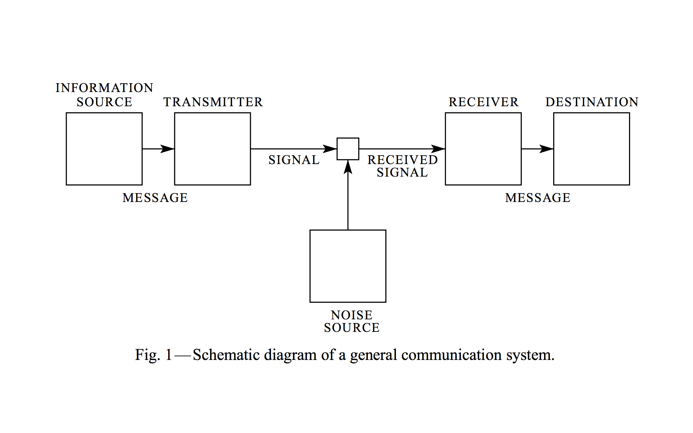

# Transmitter

Async declarative reactive component-based (and other buzzwords) programming made easy.

Inspired by [Relay](https://facebook.github.io/relay). An attempt to create unified container solution.

***NB***: For now Transmitter depends on [Rx](https://github.com/Reactive-Extensions/RxJS) (used as peer dependency).

## Introduction

The idea of transmitter for UI is heavily inspired by [A Mathematical Theory of Communication](http://worrydream.com/refs/Shannon%20-%20A%20Mathematical%20Theory%20of%20Communication.pdf).



## Installation

Install via NPM:

```bash
npm install --save retransmitter
```

Require the lib in your code:

```javascript
import Transmitter from 'retransmitter';
```

Still using that old syntax?

```javascript
var Transmitter = require('retransmitter');
```

***NB***: If you're NPM3 user please make sure you have [these dependencies](https://github.com/alexeyraspopov/retransmitter/blob/06e1fe52e6ffb4e409bd14a6adf5205ca9b1f7c1/package.json#L32-L34) installed. I'll make these dependencies as own dependencies after NPM3 will be used widely.

```bash
npm install --save react react-dom rx
```

## How it works

Just `combineLatest` operator magic. See more [on ReactiveX.io](http://reactivex.io/documentation/operators/combinelatest.html).

## API

### `Transmitter.create(Component, options)`

 * `Component` — React Component or enum `{pending, success, failure}` of React Components.
 * `options` — object with next definitions:
   * `initialVariables` **(optional)** — an object with predefined variables for fragments.
   * `fragments` — set of functions that are fetching data from different sources. Names should be the same as follow prop names in the component you're using.
   * `shouldContainerUpdate()` **(optional)** — lifecycle hook that receives new props and returns `true` or `false`.

### `Transmitter.fromStore(store)`

Creates an Observable from Store ([Flux](https://github.com/facebook/flux), [Redux](https://github.com/rackt/redux), etc). Store is an object that provides next API:

 * `getState()` — returns current state of this store.
 * `subscribe()` — adds a change listener and returns `unsubscribe` function.

### `Transmitter.fromPromise(promise)`

This method is not required for using. If you use native Promises you can just return them as fragment's result.

See more [in RxJS docs](https://github.com/Reactive-Extensions/RxJS/blob/master/doc/api/core/operators/frompromise.md).

### `Transmitter.fromValue(value)`

Use if you want to pass dummy or constant data via fragment. If you want to pass event hook (ie Flux's Action Creator) you don't need to use `fromValue`.

See more [in RxJS docs](https://github.com/Reactive-Extensions/RxJS/blob/master/doc/api/core/operators/return.md).

## ES6 class-based API

```javascript
class UserInfoContainer extends Transmitter.Container {
	observe({userId}) {
		return {
			user: fetch(`/users/${userId}`),
		};
	}

	render() {
		return <UserInfo user={this.state.user} />;
	}
}
```

```javascript
class TodoListContainer extends Transmitter.Container {
	observe() {
		return {
			todos: fetch('/todos'),
			query: Transmitter.fromStore(QueryStore),
		};
	}

	render() {
		return <TodoList todos={this.state.todos} query={this.state.query} />
	}
}
```

## Examples

```javascript
function Item({key, title, description}) {
	return (
		<article>
			<h2>{title}</h2>
			<p>{description}</p>
			<p><a href={`/articles/${key}`}>Read more</a></p>
		</article>
	);
}
```

```javascript
function ItemsList({items = []}) {
	return (
		<section>
			{items.map(({id, title, description}) =>
				<Item key={id} title={title} description={description} />
			)}
		</section>
	);
}
```

```javascript
ItemsListContainer = Transmitter.create(ItemsList, {
	items() {
		return fetch('/items')
			.then(r => r.json());
	}
});
```

```javascript
ReactDOM.render(<ItemsListContainer />, ...);
```

## Multiple choise component

```javascript
ItemsListContainer = Transmitter.create({
	pending: LoadingSpinner,
	success: ItemsList,
	failure: ItemsListError
}, {
	items() {
		return fetch('/items')
			.then(r => r.json());
	},
	query() {
		return Transmitter.fromStore(QueryStore);
	},
	onSelect() {
		return ItemsActions.selectItem;
	}
});
```

```
--[items]-------------------------------|> (from items fragment)
------"query"----------"query2"---------|> (from query store)
------{items, query}---{items, query2}--|> (result that will be passed to ItemsList)
```

When `<ItemsListContainer />` is added to the view `pending` component will be rendered at first. `pending` component will be rendered with props:

 * `onAbort` — the callback that used as event hook and dispose all fragments fetching processes.

After loading is finished `success` or `failure` component will be rendered (depends on results). `failure` component will receive next props:

 * `error` — the error instance that will be received in failed getter.
 * `onRetry` — the callback that can be attached as event hook and will restart data fetching.

## Support

 - [x] Promises
 - [x] Observables
 - [x] Falcor (since it uses Promises and Observables)
 - [x] Stores (Flux, Redux) (See [`Transmitter.fromStore()`](#transmitterfromstorestore))
 - [ ] CSP channels
 - [ ] Relay
